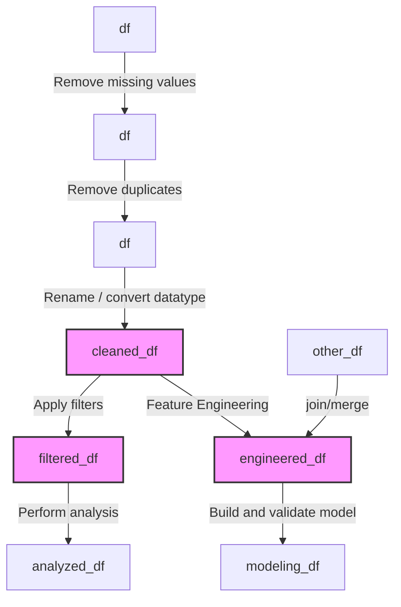

# faq-of-ds-at-tripleten

# General Questions

## Useful links

### Free resource for practicing Python

[Python Exercises](https://pynative.com/python-exercises-with-solutions/)

[W3Schools](https://www.w3schools.com/python/default.asp)

## About the dataframe variables in Jupyter Notebooks



# Sprint 0 & 1

## For loop

```python
names = ['Adam', 'Bob', 'David', 'Harry']
#print(names[1])
# Method 1
for i in range(len(names)):
    #print(i, names[i])
    print(names[i])
    if len(names[i]) < 4:
        names[i] = "Elise"
    
print(names)

# Method 2
print("="*20, " Method 2", "="*20)
for name in names:
    print(name)
    if len(name) < 4:
        print(name, " is a short name.")
    elif len(name) == 4:
        print(name, " is equal to 4")
    else:
        print(name, " is longer than 4")

# Method 3
print("="*20, " Method 3", "="*20)

for i, name in enumerate(names):
    print(i, name)
    
```
## If statement


```python
if num <= 4:
    print("A")
elif (num > 4) & (num <= 6):
    print("B")
elif (num > 6) & (num <= 7):
    print("C")
elif (num > 7) & (num <= 8):
    print("D")
else:
    print("Else")
```

