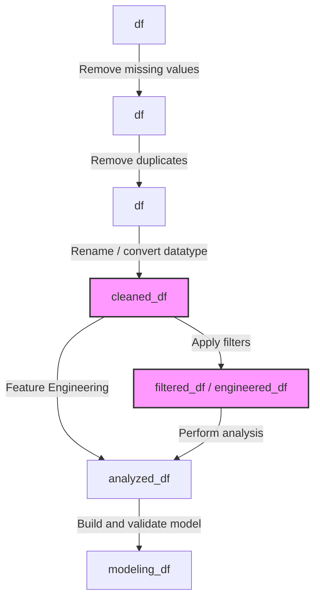

# faq-of-ds-at-tripleten

# General Questions

## About the dataframe variables in Jupyter Notebooks

```mermaid
graph TD
    A[df] --> |Remove missing values| B[df]
    B[df] --> |Remove duplicates| C[df]
    C[df] --> |Rename / convert datatype | D[cleaned_df]
    D[cleaned_df] --> |Apply filters| E[filtered_df / engineered_df]
    D[cleaned_df] --> | Feature Engineering| F[engineered_df]
    E --> |Perform analysis| F[analyzed_df]
    F --> |Build and validate model| G[modeling_df]
    classDef milestone fill:#f9f,stroke:#333,stroke-width:2px;

    D:::milestone
    E:::milestone


```