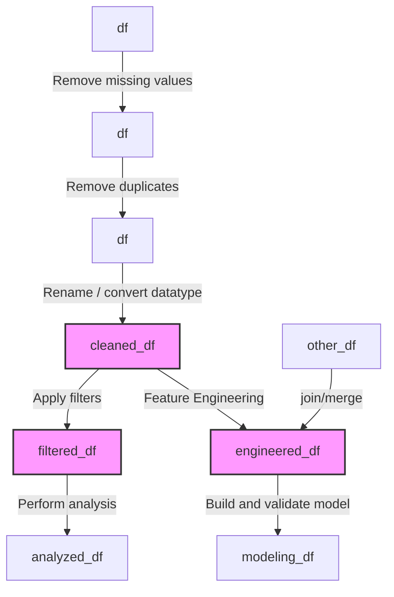
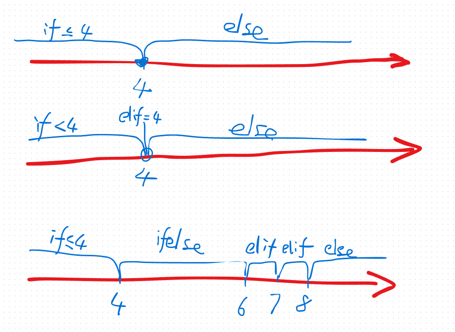

# faq-of-ds-at-tripleten

# General Questions

## Useful links

[roadmap](https://roadmap.sh/ai-data-scientist)

### Free resource for practicing Python

[W3Schools](https://www.w3schools.com/python/default.asp)

[Python Exercises](https://pynative.com/python-exercises-with-solutions/)

[mimo](https://mimo.org/): Duolingo of Python

[Practice Pandas](https://www.geeksforgeeks.org/pandas-practice-excercises-questions-and-solutions/)

[Pandas cheatsheet](https://github.com/stemgene/faq-of-ds-at-tripleten/blob/main/pandas-cheat-sheet.md)

## About the dataframe variables in Jupyter Notebooks



## Multiple path

```python
try:
    products = pd.read_csv("C:/....") # opt 1
except FileNotFoundError :
    products = pd.read_csv("/datasets/products.csv", sep=";") # opt 2
    
```

# Sprint 0 & 1

## For loop
<html>
<script src="https://gist.github.com/stemgene/83349a0f6ef230b9a779db468456d447.js"></script>
</html>

```python
names = ['Adam', 'Bob', 'David', 'Harry']
#print(names[1])
# Method 1
for i in range(len(names)):
    #print(i, names[i])
    print(names[i])
    if len(names[i]) < 4:
        names[i] = "Elise"
    
print(names)

# Method 2
print("="*20, " Method 2", "="*20)
for name in names:
    print(name)
    if len(name) < 4:
        print(name, " is a short name.")
    elif len(name) == 4:
        print(name, " is equal to 4")
    else:
        print(name, " is longer than 4")

# Method 3
print("="*20, " Method 3", "="*20)

for i, name in enumerate(names):
    print(i, name)
    
```
## If statement



```python
if num <= 4:
    print("A")
elif (num > 4) & (num <= 6):
    print("B")
elif (num > 6) & (num <= 7):
    print("C")
elif (num > 7) & (num <= 8):
    print("D")
else:
    print("Else")
```
## List comprehension

```python
print("="*20, " List Comprehension", "="*20)
nums = []
for i in range(10):
    nums.append(i)
print(nums)

nums = [i*2 for i in range(10)] # [item for-loop]
print(nums)

nums = [i*2 for i in range(10) if i%2==1] # [item for-loop if]
print(nums)
```

# Sprint 3

[To explain merging tables](https://docs.google.com/spreadsheets/d/13slsNh26uWZKVMHSMuPZCjIvKleY1I9JMuvvuwwb_o4/edit?gid=0#gid=0) 


# Sprint 4

```
altair==4.2.0
```

# Sprint 6

[how to build a database on VSCode](https://www.youtube.com/watch?v=cc-cSSsGqbA)

# Sprint 8

Split dataset


Machine Learning Process

```python
features_train, label_train, features_test, label_test

model = decisiontree(max_depth=3)
model.fit(features_train, label_train)
prediction = model.predict(features_test)
accuracy = metric(label_test, prediction)
# 1st trial
accuracy = 0.6
# 2nd trail
accuracy = 0.65
# 3rd trail
accuracy = 0.7
...
```python


```python
X_train, y_train, X_val, y_val, X_test, y_test -> check if they are the same distribution
# 1. Training session

# 1st round
model
model.fit(X_train, y_train)
prediction = model.predict(X_val)
metric_1st = f1(y_val, prediction)  # metric_1st is good enough?

# 2. fine tuning session

# 2nd round handle unbanlanced data
X_train = upsample(X_train)
model.fit(X_train, y_train)
prediction = model.predict(X_val)
metric_2nd = f1(y_val, prediction)  # metric_2nd is good enough? 

# 3rd round fine tuning the model
best_params = gridsearch()
model = rh(best_params)
model.fit(X_train, y_train)
prediction = model.predict(X_val)
metric_2nd = f1(y_val, prediction)  # metric_3rd is good enough? 

# 4th and further fine tuning loop
# if metric is good:
#     finish
# else:
#     4th round
    # feature engineering (generate new columns, drop columns)
    # new models (LightGBM, XGBoost, CatBoost)
    # Bayes optimization method

# 3. test session
# Once We've a good result on validation set

prediction = model.predict(X_test)
final_metric = f1(y_test, prediction)
```

## Issue for installing `imbalanced-learn`

`!pip install imbalanced-learn==0.8.0`

# Sprint 9

Calculate profit for 1 region:

```python
state = np.random.RandomState(42)
pred_target_region0 = pred_target_dfs[0]
# print(pred_target_region0)  # (25000, 2) y_pred target
pred = pred_target_region0['y_pred']
target = pred_target_region0['target']

# bootstrap
values = []
for i in range(1000):
    target_subsample = target.sample(n=500, replace=True, random_state=state)
    pred_subsample = pred[target_subsample.index]
    # print(target_subsample, pred_subsample) # the values should be 30s ~ 160s
    
    # calculate profit
    # sort 
    pred_sorted = pred_subsample.sort_values(ascending=False)
    # get top 200 samples
    selected = target_subsample[pred_sorted.index][:200] # selected: 160s, 150s...
    profit = UNIT_REVENUE * selected.sum() - BUDGET # selected.sum(): around 25000... 
    values.append(profit)
```

# Sprint 10

## Introduce the cross validation with the customerized metric function

```python
def smape_series(y_test, y_pred):
    y_test = np.array(y_test)
    y_pred = np.array(y_pred)
    denominator = (np.abs(y_test) + np.abs(y_pred)) 
    nonzero_indices = denominator != 0
    smape_value = np.mean(np.abs(y_test[nonzero_indices] - y_pred[nonzero_indices]) / denominator[nonzero_indices])
    return smape_value

def smape_individual(y_test, y_pred):
    y_test = np.array(y_test)
    y_pred = np.array(y_pred)
    result = 0
    for i in range(len(y_test)):
        result += abs(y_test[i] - y_pred[i]) / ((abs(y_test[i]) + abs(y_pred[i]))/2 + 1e-15)
    result = result / len(y_test)
    return result
    
smape_scorer = make_scorer(smape, greater_is_better=False)
cross_validate(model, X_train, y_train, scoring=smape_scorer)
```